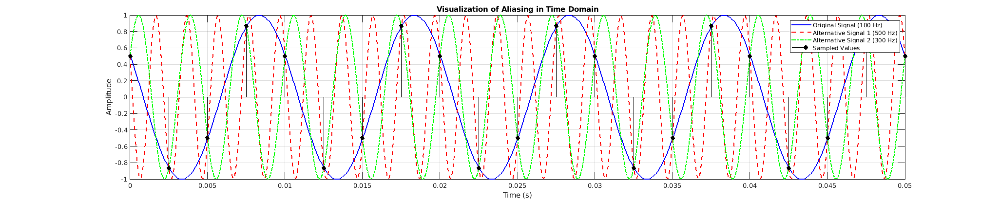
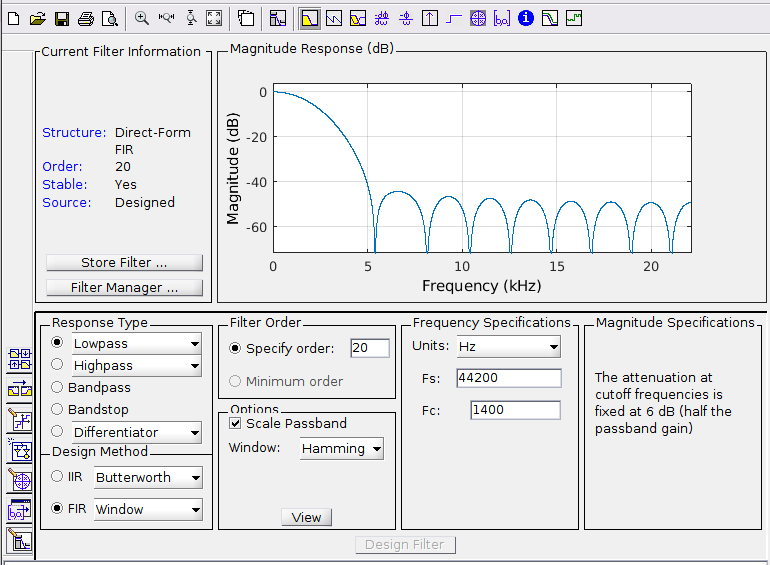
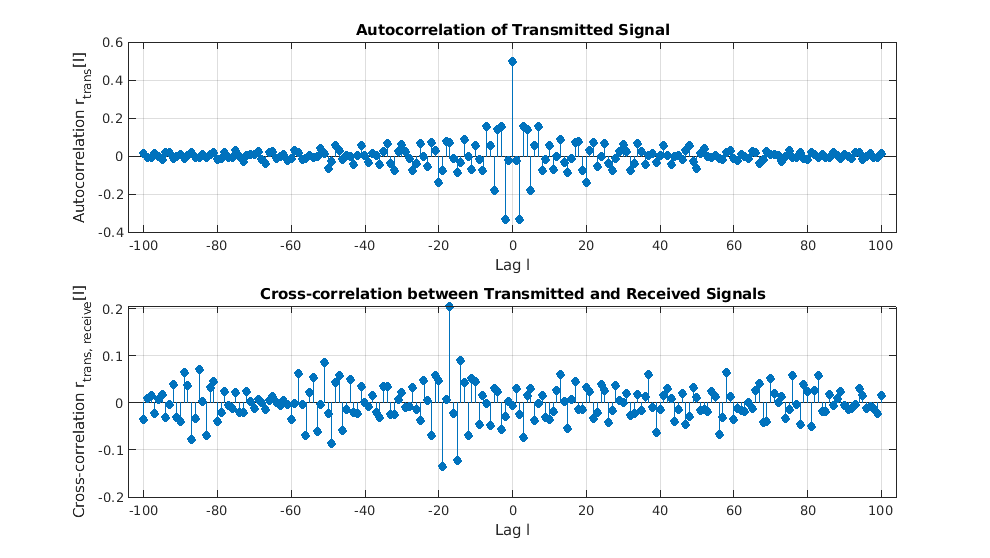

# DSP Fundamentals (5ESC0), TU/e

MATLAB lab work for the Digital Signal Processing course (5ESC0) at Eindhoven University of Technology. The three labs move from sampling and reconstruction of continuous-time signals, through the DFT and FIR filter design, to statistical signal processing and correlation-based detection. Each lab folder holds the MATLAB code, the input and output data it operates on, and the figures the scripts produce.

## Lab 1: sampling, reconstruction, and multirate processing

Covers the sampling theorem and what happens when it is violated. The scripts reconstruct a discrete signal back to continuous time with sinc interpolation (`sincinterpolation.m`, `lab1_8b.m`), and show aliasing directly by sampling a 100 Hz tone at a rate where 300 Hz and 500 Hz components fold onto the same samples.

`downsample_10.m` and `upsample_10.m` apply rate conversion to an audio file (`scale.wav`) both with and without an anti-aliasing / anti-imaging lowpass filter, then compare the FFT magnitude spectra of each output. The resampled audio is written to the `lab1-files` folder so the audible effect of skipping the filter can be checked. `dsp_ex4.m` and `dsp_ex5.m` plot the magnitude and phase of the frequency response `H(e^{jθ})` for simple difference-equation systems.



A 100 Hz tone and its 300 Hz and 500 Hz aliases pass through the same sample values, which is why they cannot be told apart after sampling.

## Lab 2: DFT, spectral leakage, windowing, and FIR filtering

Works through the discrete Fourier transform and the practical issues of computing spectra from finite records. `ex2.m` samples two close sinusoids (10 Hz and 11 Hz at fs = 80 Hz, N = 80) to show the difference between a frequency that lands exactly on a DFT bin and one that leaks across bins. Other scripts compare rectangular and Hanning windows and the effect of zero-padding and record length on the magnitude spectrum.

`lab2_6.m` designs windowed-sinc FIR lowpass filters for filter lengths of 7, 15, and 111 taps and plots their frequency responses with `freqz`. `lab2_7.m` uses a designed filter (exported from MATLAB's filter design tool) to remove an added sinusoidal tone from an audio clip, comparing the filtered and unfiltered spectra and writing the cleaned audio back out.



Order-20 windowed FIR lowpass designed in the filter design tool, showing the magnitude response and the Hamming-window specification.

## Lab 3: statistical signal processing and correlation

Estimates the statistics of random signals and uses correlation for detection. `assignment_5a.m` implements a cross-correlation estimator from scratch; `assignment_5bc.m` estimates the autocorrelation of white noise and of a filtered process, then obtains the power spectral density from the FFT of the autocorrelation and compares it against the analytical result.

The `untitled*.m` scripts study how averaging many independent Gaussian processes changes the variance and the normalized cross-covariance coefficient, comparing Monte Carlo estimates against closed-form expressions. The final assignment loads a radar record (`radar-5.mat`) and uses autocorrelation of the transmitted signal and cross-correlation between transmitted and received signals to locate the echo delay.



Autocorrelation of the transmitted signal (top) and cross-correlation with the received signal (bottom). The cross-correlation peak away from zero lag marks the round-trip delay of the reflected signal.

## Repository layout

```
lab1/  sampling, sinc interpolation, up/downsampling of audio, frequency response
lab2/  DFT, spectral leakage, windowing, windowed-sinc FIR design, audio de-noising
lab3/  cross/autocorrelation, PSD estimation, statistics of random processes, radar detection
```

Each lab has a `-code` folder for the scripts, a `-files` folder for input/output data (`.wav`, `.mat`, filter design files), and a `-pics` folder for the generated figures.

## Running

The scripts run in MATLAB. Set the working directory to the relevant `-code` folder (or add the `-files` folder to the path) so the audio and data files resolve, then run a script. `lab2_7.m` and `lab1` resampling scripts read and write `.wav` files in place. Filter design uses the Signal Processing Toolbox (`lowpass`, `freqz`, `fft`, and the filter design tool).

## Technologies

- MATLAB
- Signal Processing Toolbox
- MATLAB Live Scripts (`.mlx`) for several exercises
